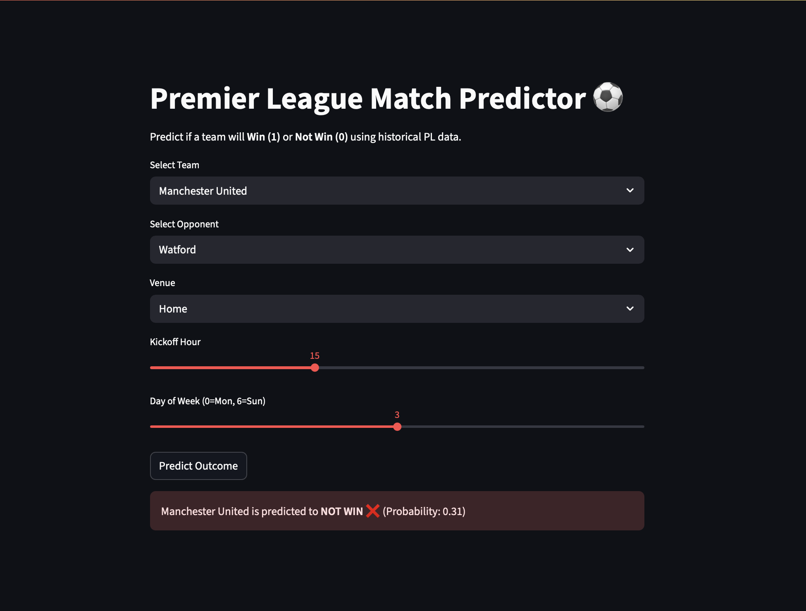

# Case Study: Predicting Premier League Match Outcomes 

## 1. Why This Project?  
Football is unpredictable — but can data tell us when a team is likely to win?  

I set out to explore whether **machine learning can predict Premier League match results** using 5 seasons of match data (2018–2022).  

The purpose wasn’t to “beat the bookies,” but to demonstrate an **end-to-end ML workflow**:  
- Collect messy real-world data  
- Clean and engineer meaningful features  
- Train and evaluate machine learning models  
- Communicate results clearly with both visuals and an interactive app  

---

## 2. Approach  
### Data Collection  
- Scraped match results and shooting statistics from [FBRef](https://fbref.com/)  
- Dataset: ~3,700 matches (2018–2022)  
- Features: team, opponent, venue, number of shots, kickoff time, etc.  

### Feature Engineering  
Converted categorical features into numerical codes and created additional features:  
- **Venue_Code** – home/away  
- **Opponent_Code** – team strength proxy  
- **Day_Code** – day of week  
- **Hour** – kickoff time   

### Modelling  
- Baseline: “always predict home win” (~50% accuracy)  
- Model: **Random Forest Classifier**  **SVM** **DNN**
- Trained on engineered features and evaluated with accuracy and confusion matrix  


---

## 3. Results  
### Classification report comparison: 
| model type | precision | recall | f1-score| support|
| :-: | :-: | :-: | :-:| :-: |
|Random forest classifier| 0.60 | 0.62 | 0.60 | 1052|
|Random forest classifier modified| 0.64 | 0.65 | 0.62 | 1047|
|SVM model with rbf kernel | 0.64 | 0.64 | 0.52 | 1047|
|SVM model with poly kernel |0.64|0.64|0.57|1047|
|deep neural network |0.62|0.63|0.61|1047|
|deep neural network with extra layers|0.62|0.61|0.48|1047|

### Accuracy comparison: 
- Random forest classifier:61.6%
- Random forest classifier modified:64.8%
- SVM model with rbf kernel :63.7%
- SVM model with poly kernel : 63.8%
- deep neural network :63.6%
- deep neural network with extra layers:61.3%

- Key predictors: **venue (home/away)** and **opponent strength**  


Insight: Machine learning captures some signal, but football remains highly unpredictable.  

---

## 4. Interactive Demo  

I built a **Streamlit app** to explore predictions interactively:  

- Select any two Premier League teams  
- Choose venue and kickoff time  
- See predicted probabilities for win/draw/loss  
 

**Sample Prediction:**  
  

Currently runs **locally**. Deployment to Streamlit Cloud is planned so it can be tried online:  
```bash
pip install -r requirements.txt
streamlit run app.py
```
